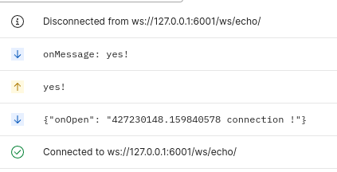

# Laravel WebSockets Demo 🛰

This is a demo application built with the [Laravel WebSockets](https://github.com/beyondcode/laravel-websockets) package.

Be sure to check out the [official documentation](https://docs.beyondco.de/laravel-websockets/).

## Usage

Composer version 1.10.26
PHP 7.1
mysql 8

1. Clone this repository
2. `php composer.phar install`
3. `cp .env.example .env`
4. `php artisan migrate`
5. `php artisan key:generate`
6. `php artisan websockets:serve`

or

1. docker-compose -p laravel-websockets-demo up -d --build
2. in docker terminal: php artisan websockets:serve

## Credits

- [Marcel Pociot](https://github.com/mpociot)
- [Freek Van der Herten](https://github.com/freekmurze)
- [All Contributors](../../contributors)

## License

The MIT License (MIT). Please see [License File](LICENSE.md) for more information.
